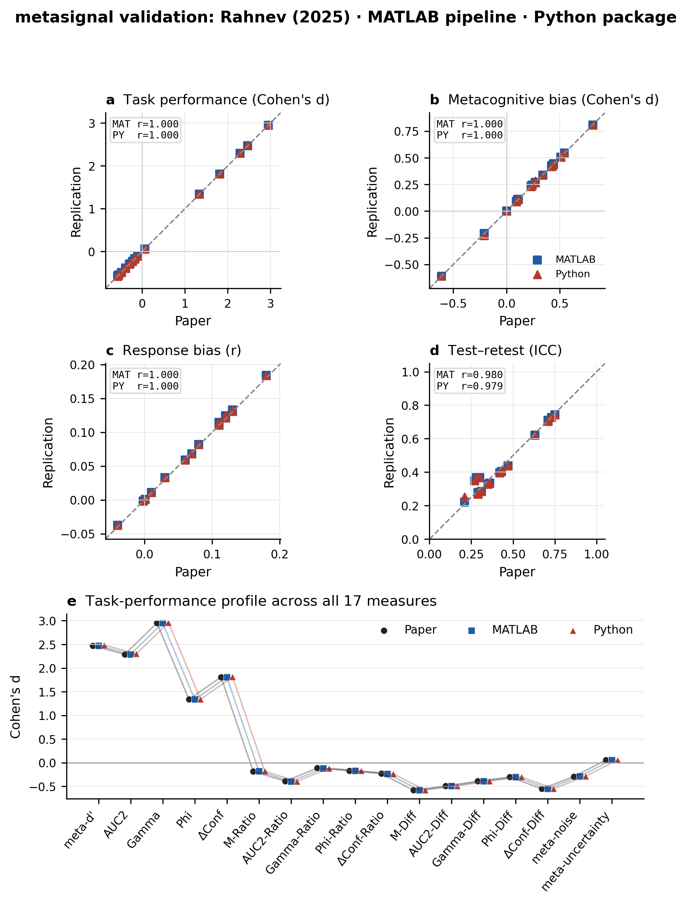

# Summary

`metasignal` is an open-source Python package for signal detection theory (SDT) and metacognitive measurement. It implements the 17 metacognitive measures evaluated by @rahnev2025, together with the reference variables d', response criterion *c*, and mean confidence. The measures include meta-d', M-ratio, M-difference, Type-2 area under the receiver-operating-characteristic curve (AUC2), Gamma, Phi, delta confidence, their SDT-normalized ratio and difference forms, meta-noise, and meta-uncertainty. A single function computes the complete set from trial-level stimulus, response, and confidence arrays. The package also provides a command-line interface, group summaries, bootstrap confidence intervals, permutation tests, optional hierarchical Bayesian models, and information-theoretic measures.

We validated the Python implementation against the original MATLAB pipeline and the numerical results reported by @rahnev2025. The validation covers subject-level estimates, published summary effects, and the analysis profiles for task performance, metacognitive bias, response bias, and reliability. This paper describes the scientific motivation, package design, validation procedure, results, and a simple workflow for new users.

# Statement of Need

Metacognition is the ability to evaluate the quality of one's own decisions. It supports learning, adaptive choice, and communication of uncertainty [@flemingdolan2012; @yeungsummerfield2012]. Metacognitive measurement is also relevant to clinical research and to the evaluation of uncertainty reported by artificial-intelligence systems [@steyvers2025; @griot2025]. A consensus statement identified reliable computational models and standardized measurement as major goals for visual-metacognition research [@rahnev2022].

Many metacognitive measures have been proposed, but they quantify different properties and respond differently to task performance, response bias, confidence bias, and sample size. Meta-d' is widely used because it expresses metacognitive sensitivity in the same SDT units as perceptual sensitivity [@maniscalco2012]. Its canonical toolbox was distributed as MATLAB code, later joined by a direct Python port [@maniscalco2014; @lee_maniscalco_type2sdt_python], but each covers meta-d' alone. The other sixteen measures benchmarked by @rahnev2025 remained spread across separate papers and software projects, with no single package covering the full set in Python. This made it difficult to compare measures within one reproducible workflow.

@rahnev2025 provided the first broad empirical comparison of 17 measures. The study assessed validity and precision, dependence on nuisance variables, split-half reliability, and test--retest reliability. `metasignal` translates this benchmark into a documented Python package that requires no proprietary software. It is intended for cognitive scientists, psychophysicists, neuroscientists, clinical researchers, and researchers studying confidence in artificial systems.

# State of the Field

The meta-d' toolbox of @maniscalco2014, including its Python port [@lee_maniscalco_type2sdt_python], remains an important reference implementation. `metadpy` [@legrand2021] and HMeta-d [@fleming2017] provide Bayesian or hierarchical estimation, but focus mainly on the meta-d' family. `statConfR` provides models of decision confidence and information-theoretic measures in R [@rausch2025]. These tools are valuable for their intended tasks, but none offers the complete @rahnev2025 benchmark through one pure-Python interface.

`metasignal` complements rather than replaces these packages. Its main contribution is breadth, a common trial-level interface, and explicit cross-language validation. The optional `sdtbayes` subpackage adds Stan-based hierarchical estimation, while the experimental `itmc` subpackage implements measures motivated by metacognitive information theory [@dayan2023; @meyen2025].

# Software Design

{width=80%}

The package follows four design principles.

First, stimulus identity, behavioral response, and confidence are represented as parallel NumPy arrays. This simple format is compatible with most behavioral data-processing workflows. Second, the stable `stdpy` layer uses NumPy [@harris2020] and SciPy [@virtanen2020] and does not require MATLAB. Third, `compute_all_measures` provides a common entry point while individual functions remain available for researchers who need one statistic. Fourth, optional Bayesian dependencies are isolated from the lightweight frequentist core.

`compute_all_measures` returns 26 values. The first 20 are the 17 metacognitive measures plus d', criterion, and mean confidence. The final six values—log-likelihood, AIC, BIC, AICc, number of fitted parameters, and number of observations—are diagnostics for the meta-d' fit, not additional metacognitive measures.

# Methods

## Core computation

The package first converts trial-level data into Type-2 response-count arrays. Type-1 sensitivity and criterion are computed under the equal-variance SDT model [@green1966]. Nonparametric Type-2 measures are computed directly from the observed counts. Meta-d' is estimated by maximum likelihood [@maniscalco2012], from which M-ratio and M-difference are derived. SDT-normalized Ratio and Difference measures compare observed statistics with statistics expected under an ideal equal-variance SDT observer.

Meta-noise is estimated with the lognormal confidence-noise model used by the MATLAB benchmark. The Python implementation follows the MATLAB procedure: it evaluates the zero-noise Gaussian baseline, searches outward from that lower bound, uses golden-section optimization, and evaluates the precomputed integral table using inverse-distance weighting. Meta-uncertainty is fitted with its corresponding model-based estimator.

## Validation data and procedure

Validation used the six datasets distributed with the Rahnev analysis pipeline: Haddara, Maniscalco, Rouault experiments 1 and 2, Shekhar, and Locke. The comparison used three sources:

1. values reported in the text, figures, and supplementary tables of @rahnev2025;
2. subject-level MATLAB arrays stored in `matlab/metasignal_mat/Results`; and
3. Python arrays generated from the same trial subsets.

Ten subject-level analysis arrays were compared: raw estimates, metacognitive-bias recoding, odd--even splits, difficulty conditions, and response-bias conditions. For each measure we examined Pearson correlation, mean absolute error, root-mean-square error, signed bias, maximum absolute error, and missing-value agreement. We also reproduced 19 statistical checks from the supplementary analyses and compared the 17-measure profiles for task-performance dependence, metacognitive-bias dependence, response-bias dependence, and test--retest reliability, the last using the same bin size (400 trials), day structure, and Fisher-*z* aggregation as the MATLAB scripts. Split-half reliability and precision were also recomputed directly from raw trial data using the bin-stratified protocol @rahnev2025 describes (non-overlapping 50/100/200/400-trial bins, analyzed per bin and Fisher-*z* averaged); this reproduces the relative pattern across measures but not the published absolute magnitude, for reasons traced to the archived bin-repeat structure rather than to `stdpy` itself (see Limitations).

The complete workflow is implemented in `analysis/rahnev_comparison/scripts`. The JSON results, CSV summaries, identity plots, profile overlays, and combined PDFs are stored beside the scripts. This makes the validation repeatable rather than dependent on a manually prepared table.

# Validation Results

{width=88%}

All 10 subject-level comparison arrays passed the predefined comparison gate, and all 19 supplementary statistical checks matched in statistical significance and reference *t* value. Across the 18 non-model-based measures, MATLAB and Python agreed to numerical precision at the subject level (maximum systematic bias below \(1.5 \times 10^{-3}\); per-analysis correlations of 1.000). Ten of these measures agreed to within a maximum absolute difference of \(10^{-2}\) across every subject and analysis.

The analysis profiles were essentially identical across sources: task-performance dependence (paper--Python *r* = 1.000; MATLAB--Python *r* = 1.000), metacognitive-bias dependence (paper--Python *r* = 1.000; MATLAB--Python *r* = 1.000), and response-bias dependence (paper--Python *r* = 1.000; MATLAB--Python *r* = 1.000). Test--retest ICC, matched to the MATLAB bin-size-400 protocol, also aligned closely (MATLAB--Python *r* = 0.999).

The two model-based measures required dedicated fixes. The meta-noise implementation was corrected in two stages: first to follow the MATLAB search and interpolation procedure, and then to preserve the boundary behavior of the signal-detection criteria (leaving hit and false-alarm rates of 0 or 1 unclipped, so that infinite criteria are initialized on the same global grid as MATLAB). After both corrections, MATLAB--Python meta-noise correlations reached 0.999 in the Haddara raw analysis, 1.000 in Maniscalco, and 1.000 in the Rouault difficulty subsets that had previously been the weakest cases (*r* = 0.734 and 0.631 before the boundary fix). Meta-uncertainty was stabilized with a deterministic multi-start optimizer that keeps the published likelihood but removes optimizer-seed noise, giving a mean cross-language correlation of 0.995 (Rouault subsets 0.993 and 0.979). Correcting SDT-expected rating arrays from trial counts to per-stimulus proportions made the Locke Ratio and Difference outputs numerically equivalent to MATLAB.

Some differences remain and are reported as limitations rather than hidden. Meta-d', M-ratio, and M-difference correlate at 1.000 across analyses but can differ by up to about 0.14 for individual participants because both pipelines use bounded numerical maximum-likelihood optimizers with different internal solvers. Meta-noise and meta-uncertainty retain a small number of subject-level differences in the sparsest difficulty subsets, where the likelihood surface is flat. A single degenerate value returned by the MATLAB meta-noise search (near 0.4959) is identified programmatically and excluded from agreement statistics. For users who need to reproduce a specific MATLAB result file rather than a scientifically stable estimate, the model-based estimators expose an optional `matlab_compat` mode that mimics MATLAB's single-start optimizer configuration. The package therefore supports the scientific conclusions of @rahnev2025 and reproduces the MATLAB pipeline to numerical precision for the non-model-based measures, while documenting the residual, well-understood variation in low-information model fits.

# Simple Procedure for Use

## Installation

Install from the public repository:

```bash
pip install git+https://github.com/saurabhr/metasignal.git
```

For development or reproducible validation:

```bash
git clone https://github.com/saurabhr/metasignal.git
cd metasignal
pip install -e .
```

## Prepare trial-level data

Each trial requires four values:

- `stim`: stimulus category, coded with two values such as 0 and 1;
- `resp`: participant response, coded with the same two values;
- `conf`: integer confidence rating from 1 to `n_ratings`; and
- `n_ratings`: number of possible confidence levels.

The arrays must have the same length. Missing trials are removed jointly. A study should compute participant-level estimates separately before group inference.

## Compute all measures

The following self-contained example simulates one participant with a fixed random seed, so that any user can run it and obtain the same numbers. This doubles as a minimal reproducibility check of the installation.

```python
import numpy as np
from metasignal import stdpy

rng = np.random.default_rng(2025)
n = 800
stim = rng.integers(0, 2, n)                 # two stimulus categories
evidence = (stim * 2 - 1) * 0.9 + rng.normal(0, 1, n)
resp = (evidence > 0).astype(int)            # observer response
edges = np.quantile(np.abs(evidence), [0.25, 0.5, 0.75])
conf = np.digitize(np.abs(evidence), edges) + 1   # 4-point confidence

values = stdpy.compute_all_measures(stim, resp, conf, n_ratings=4)

meta_d  = values[0]    # meta-d'
auc2    = values[1]    # Type-2 AUC
m_ratio = values[5]    # M-ratio (meta-d'/d')
dprime  = values[17]   # d'
print(f"d'={dprime:.3f}  meta-d'={meta_d:.3f}  M-ratio={m_ratio:.3f}  AUC2={auc2:.3f}")
```

Running this prints:

```text
d'=1.929  meta-d'=1.841  M-ratio=0.955  AUC2=0.762
```

`compute_all_measures` returns all 26 values in a fixed order; the first 20 are the 17 metacognitive measures plus d', criterion, and mean confidence, and the last six are meta-d' fit diagnostics. Researchers should use realistic trial counts for scientific estimation; the seed here only makes the example reproducible.

## Compute selected measures

```python
dprime, criterion, ln_beta = stdpy.compute_sdt_resp(stim, resp)
nr_s1, nr_s2 = stdpy.trials_to_counts(stim, resp, conf, n_ratings=4)
meta_fit = stdpy.fit_meta_d_mle(nr_s1, nr_s2)
auc2 = stdpy.compute_type2_auc(nr_s1, nr_s2)

print(meta_fit["meta_da"])
print(meta_fit["M_ratio"])
```

## Command-line use

```bash
metasignal compute \
  --stim "0,1,0,1,0,1,0,1" \
  --resp "0,1,0,0,0,1,1,1" \
  --conf "4,4,3,1,3,4,2,3" \
  --n-ratings 4
```

## Recommended scientific workflow

1. Check that stimulus and response each contain two categories.
2. Confirm that confidence values are integers within the declared scale.
3. Compute measures independently for each participant and condition.
4. Inspect missing values and convergence diagnostics before group analysis.
5. Use bootstrap intervals or permutation tests when sampling distributions are uncertain.
6. Report the measure definition, trial count, confidence scale, exclusion criteria, and reliability protocol.
7. For direct replication, preserve the original bin sizes, recoding rules, and random-resampling procedure.

# Research Impact Statement

`metasignal` turns a broad methodological benchmark into reusable research infrastructure. It provides a common implementation for comparing measures, lowers the barrier for laboratories without MATLAB, and makes numerical validation visible and reproducible. Seven tutorial notebooks cover preprocessing, measure computation, statistical tables, difficulty dependence, bias, split-half reliability, and test--retest reliability. Automated tests, continuous integration, API documentation, and contribution guidelines support reuse and extension.

The validation materials are also a scholarly contribution. They identify implementation details that materially affect results—especially the zero-noise boundary in meta-noise fitting and the use of proportions in SDT-expected ratings. Recording these details helps prevent apparently contradictory results that arise from software rather than theory.

# Limitations

No single measure is optimal for every design [@rahnev2025]. Model-based measures can be unstable with small samples or sparse confidence categories. Ratio measures can become extreme when their expected denominator approaches zero — the same instability that our current single-bin precision check triggers for measures such as Gamma-Ratio, since it skips the bin-averaging that damps this in the published protocol (see below). Reliability estimates depend on bin size and resampling design. The optional Bayesian and information-theoretic components have broader dependencies and should not be interpreted as direct replacements for the 17-measure benchmark. Users should choose measures based on their scientific question and report analysis settings completely.

Split-half reliability and precision remain incompletely validated against @rahnev2025, and for a more specific reason than a missing bin-averaging step. We implemented the bin-stratified protocol described in the Methods (non-overlapping 50/100/200/400-trial bins, analyzed per bin and Fisher-*z* averaged) directly from raw trial data. This reproduces the *relative* pattern of split-half reliability across all 17 measures well (*r* = 0.965 against the Figure 7 ranking — `ΔConf` highest, meta-noise lowest, matching the paper) but underestimates the *absolute* reliability by roughly half throughout (e.g. meta-noise: 0.84 published vs. 0.13 here). Applying the identical per-bin correlation procedure to the MATLAB split-half arrays already bundled with this repository reproduces the same undershoot (e.g. meta-d': 0.89 published vs. 0.55 from the bundled MATLAB cache), which rules out a `stdpy` computation error and instead points to how non-overlapping bins and their per-day repeats were originally sampled in the analysis code that generated those `.mat` files — a detail not fully recoverable from the Methods section's prose alone. Precision shows the same shortfall with substantially more sampling noise: under a bin-instance cap needed to keep computation tractable, the least-stable measures (Gamma-Ratio, meta-noise, meta-uncertainty) occasionally reverse sign, consistent with the small-sample instability @rahnev2025 documents for these measures directly. None of this affects the validated measures themselves — the same `stdpy` functions reproduce the published task-performance, metacognitive-bias, and response-bias profiles at *r* = 1.000 — and readers should not treat any currently-reported split-half or precision correlation against @rahnev2025 as protocol-matched.

# Conclusions

`metasignal` provides a simple, open, and validated Python interface to the principal SDT and metacognitive measures compared by @rahnev2025. The Python implementation reproduces the MATLAB and published profiles closely for the central task-performance, metacognitive-bias, and response-bias analyses. The package combines breadth, ease of use, transparent validation, and optional inferential tools. Remaining differences are localized to low-information model fits or unmatched reliability protocols and are documented explicitly. This combination makes `metasignal` suitable for reproducible metacognition research while preserving appropriate scientific caution.

# AI Usage Disclosure

Claude (Anthropic) and OpenAI language models were used to assist with initial drafts of portions of the source code, documentation, validation report, and manuscript. All software behavior, numerical comparisons, citations, scientific claims, and final wording were reviewed and edited by the authors. Responsibility for the software and manuscript remains with the authors.

# References
