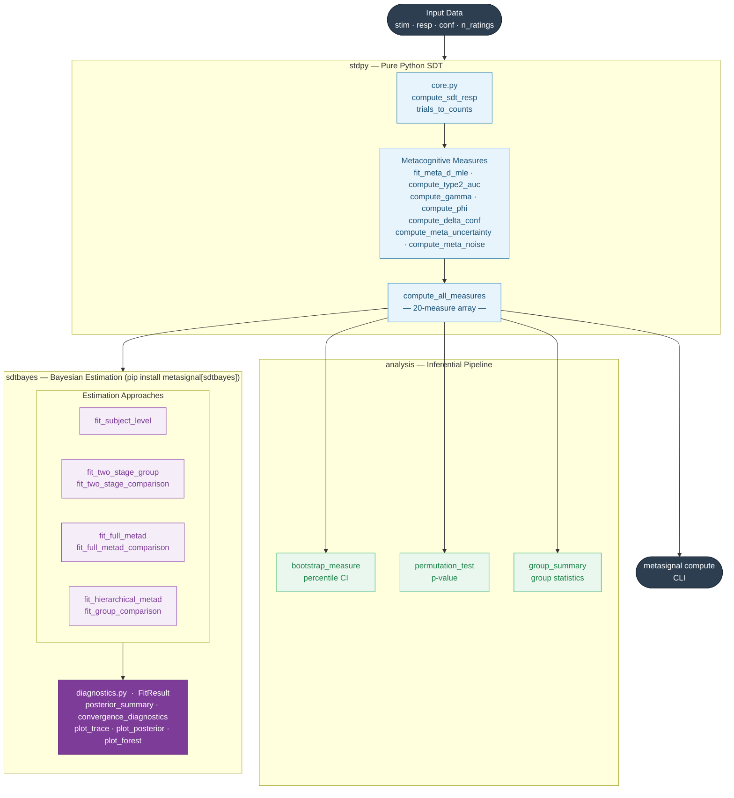

# metasignal — Library Structure

## Key

| Colour | Meaning |
|---|---|
| Dark | Input / CLI entry points |
| Blue | `stdpy` SDT computation layer |
| Green | `analysis` inferential pipeline |
| Purple | `sdtbayes` Bayesian estimation (optional) |
| Solid arrow | Data / control flow |
